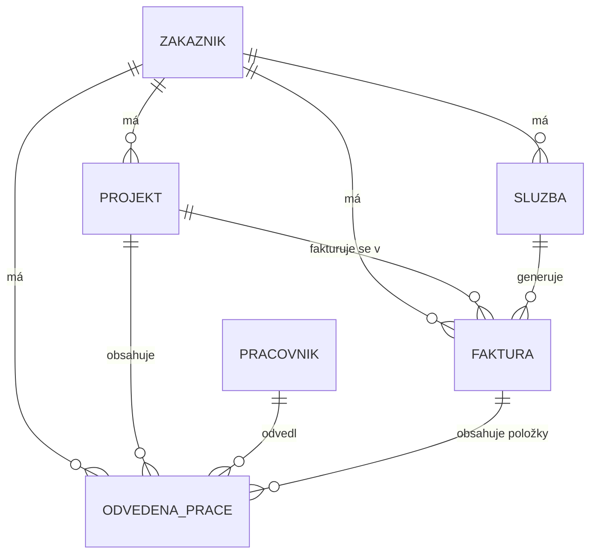

# ISSP CRM — Project Brief

> Tento dokument je vstupní specifikace pro vývoj v Cursoru. Cílem je postavit
> webovou aplikaci ISSP CRM jako samostatný projekt vedle sesterské aplikace
> **FaktuMatch** (automatizace importu faktur z bankovního výpisu), se stejným
> vzhledem a stejným způsobem přihlašování, ale s **oddělenou databází**.
> Integrace do Microsoft Power Platform / Dataverse se **již nepoužívá** —
> předchozí schéma z Dataverse (publisher prefix `crmissp_`) je zde
> přepracované do vlastní PostgreSQL databáze.

## 1. Účel aplikace

ISSP CRM slouží k evidenci:

- **Zákazníků** (firmy, IČO jako hlavní identifikátor, fakturační údaje, postup fakturace)
- **Projektů** vázaných na zákazníka (rozsah, sazba fakturace)
- **Pracovníků** (zaměstnanci/dodavatelé, nákladová sazba)
- **Odvedené práce** (výkazy práce — čas, druh činnosti, částky k fakturaci a nákladům)
- **Faktur** (zatím bez automatické generace — jen evidence; generování faktur je budoucí fáze)
- **Služeb** (opakující se předplatné typu servisní paušál s automatickým výpočtem příští fakturace)

## 2. Vztah k FaktuMatch

- **Vzhled**: shodný design systém, komponenty, layout, barevná paleta jako FaktuMatch.
- **Přihlašování**: shodný mechanismus — **NextAuth.js / Auth.js**. Vlastní
  Credentials provider (e-mail + heslo, hash přes bcrypt), stejná UI obrazovka
  loginu jako ve FaktuMatch.
- **Databáze**: **oddělená** od FaktuMatch. Uživatelské účty ISSP CRM nejsou
  sdílené s FaktuMatch (dokud nebude specifikováno jinak) — jde o dvě
  samostatné aplikace s vlastními tabulkami uživatelů.
- **Budoucí propojení**: počítat s tím, že ISSP CRM se v budoucí fázi napojí
  na FaktuMatch (např. párování vystavených/přijatých faktur z bankovního
  výpisu na záznamy v `crmissp.faktura`). Návrh datového modelu proto
  ponechává na `faktura` a `odvedena_prace` pole připravená pro pozdější
  napojení (`external_ref`, `stav_fakturace` apod. — viz schéma).
- **Hosting**: aplikace poběží na **Vercelu**, stejně jako FaktuMatch.
- **Databázový server**: vlastní PostgreSQL na `resvm1.issupport.cz` (stejný
  server jako FaktuMatch), ale **nová databáze** `apireg`, **schéma**
  `crmissp`, **DB uživatel** `crmissp` (samostatná role, samostatné heslo —
  viz `.env.example` / `CREDENTIALS.md`).

## 3. Tech stack

| Vrstva | Volba |
|---|---|
| Framework | Next.js (App Router), TypeScript |
| Styling | Tailwind CSS — sdílená design tokeny s FaktuMatch |
| Auth | NextAuth.js (Auth.js) v5, Credentials provider |
| DB přístup | Vlastní tenký DB layer nad `pg` (node-postgres), bez ORM — stejně jako FaktuMatch |
| DB | PostgreSQL, self-hosted na `resvm1.issupport.cz`, databáze `apireg`, schéma `crmissp` |
| Hosting | Vercel |
| Migrace | ruční `.sql` migrační soubory ve `database/migrations` (žádný ORM migration nástroj) |

> Pozn.: FaktuMatch nepoužívá ORM ani hostovanou DB platformu (Neon/Supabase),
> ale vlastní PostgreSQL server. ISSP CRM tento vzor kopíruje kvůli
> konzistenci kódu i provozu (jeden DB server, dvě databáze/schémata).

## 4. Databázové připojení

```
Host:      resvm1.issupport.cz
Port:      5432
Database:  apireg
Schema:    crmissp
User:      crmissp
Password:  viz CREDENTIALS.md / .env (needs to be provisioned on the server)
SSL:       podle konfigurace serveru (doporučeno sslmode=require)
```

Connection string (příklad):
```
DATABASE_URL=postgresql://crmissp:<PASSWORD>@resvm1.issupport.cz:5432/apireg?schema=crmissp&sslmode=require
```

Nastavení `search_path` na úrovni role, aby nebylo nutné prefixovat každý dotaz:
```sql
ALTER ROLE crmissp SET search_path = crmissp, public;
```

**Poznámka k provizi:** databázi `apireg`, schéma `crmissp` a roli `crmissp`
je potřeba na serveru `resvm1.issupport.cz` reálně založit (viz
`database/00_provision.sql`) — vygenerované heslo je pouze návrh, při
provizi ho nastav skutečně na serveru a ulož do secrets (Vercel env vars),
nikde do repozitáře.

## 5. Datový model

Šest hlavních entit (převzato z původního Dataverse návrhu, přemapováno do
relační PostgreSQL podoby v schématu `crmissp`):



Podrobný popis polí je v `database/schema.sql` (zdroj pravdy). Shrnutí:

### `zakaznik`
IČO (unikátní), název, IČ DPH, kontaktní e-mail/telefon, fakturační adresa
(ulice/město/PSČ), postup fakturace (volný text), stav (aktivní/neaktivní).

### `pracovnik`
Jméno, příjmení, e-mail, typ (zaměstnanec/dodavatel), náklad na hodinu,
měna, sazba platná od. *(MVP: jedna sazba na pracovníka, bez historie podle
projektu — stejně jako v původním Dataverse návrhu.)*

### `projekt`
Název, vazba na zákazníka, datum od/do, hodinová sazba fakturace, měna,
stav (aktivní/pozastaven/uzavřen).

### `odvedena_prace`
Datum, hodiny + minuty, druh činnosti (práce/administrativa/konzultace/
cestovné), vazby na zákazníka/projekt/pracovníka, popis, částka fakturace
(dopočet: `(hodiny + minuty/60) × sazba_projektu`), nákladová částka
(dopočet: `(hodiny + minuty/60) × náklad_pracovníka`), stav fakturace
(nefakturováno/fakturováno/storno), volitelná vazba na fakturu.

### `faktura`
Číslo faktury, vazby na zákazníka/projekt/službu, datum vystavení/
splatnosti/uhrazení, částka bez DPH, sazba DPH, celková částka, stav
(rozpracovaná/vystavena/uhrazena/po splatnosti/storno), typ (projektová/
servisní/záloha/dobropis).

### `sluzba`
Název služby, vazba na zákazníka, frekvence (měsíčně/kvartálně/pololetně/
ročně/vlastní) + frekvence ve dnech, cena za období, měna, poslední platba,
**další fakturace = poslední_platba + frekvence_dnu** (generovaný sloupec),
stav (aktivní/pozastavena/ukončena).

### `users` (auth)
E-mail, hash hesla, jméno, role, časové značky — vlastní tabulka pro
NextAuth Credentials provider, oddělená od FaktuMatch.

## 6. Byznys pravidla (přenesená z Dataverse Business Rules / calculated fields)

| Pravidlo | Implementace v novém stacku |
|---|---|
| `odvedena_prace.castka_fakturace` = (hodiny + minuty/60) × sazba projektu | Trigger nebo výpočet v aplikační vrstvě při ukládání (doporučeno: trigger v DB pro konzistenci) |
| `odvedena_prace.castka_naklady` = (hodiny + minuty/60) × náklad pracovníka | Stejně jako výše |
| `sluzba.dalsi_fakturace` = `posledni_platba + frekvence_dnu` | Generated column (`GENERATED ALWAYS AS ... STORED`) |
| Minuty musí být 0–59 | `CHECK` constraint |
| Faktura po splatnosti → stav "Po splatnosti" | Denní scheduled job (Vercel Cron) kontrolující `datum_splatnosti < dnes AND stav = 'vystavena'` |
| Upozornění na blížící se fakturaci služby (do 30 dní) | Denní scheduled job (Vercel Cron), náhrada za původní Power Automate flow — e-mail/notifikace |

## 7. Navigace / moduly aplikace

Odpovídá původní sitemapě Model-driven appky, přeneseno do vlastního UI:

```
Zákazníci
  → Detail zákazníka (subgrid: projekty, služby, faktury)
Projekty & práce
  → Projekty
  → Odvedená práce (výkazy)
Fakturace
  → Faktury
  → Služby (přehled s barevným odlišením podle blížící se fakturace —
     červená/oranžová/zelená podle `dalsi_fakturace - dnes`)
Pracovníci
```

## 8. Autentizace

- NextAuth.js (Auth.js) v5, Credentials provider.
- Tabulka `crmissp.users` (samostatná od FaktuMatch).
- Stejná login obrazovka a session handling jako ve FaktuMatch (kopírovat
  komponenty/config strukturu, ne data).
- Hesla hashovaná přes bcrypt, session přes JWT nebo DB session (podle toho,
  co používá FaktuMatch — zachovat konzistenci).

## 9. Roadmap

1. **Fáze 1 (teď)**: CRUD evidence pro všech 6 entit + auth + navigace, 1:1
   funkčně s tím, co bylo v Dataverse.
2. **Fáze 2**: generování faktur ze `sluzba` a `odvedena_prace` (pole
   `stav_fakturace`, `faktura_id` jsou už připravená).
3. **Fáze 3**: napojení na FaktuMatch — párování bankovních plateb s
   fakturami v `crmissp.faktura` (přes API mezi oběma aplikacemi nebo
   sdílenou integrační vrstvu — DB zůstává oddělená).

## 10. Navrhovaná struktura projektu

```
issp-crm/
├── app/
│   ├── (auth)/
│   │   └── login/
│   ├── (dashboard)/
│   │   ├── zakaznici/
│   │   ├── projekty/
│   │   ├── prace/
│   │   ├── faktury/
│   │   ├── sluzby/
│   │   └── pracovnici/
│   └── api/
│       └── auth/[...nextauth]/
├── lib/
│   ├── db.ts              # pg pool, connection z DATABASE_URL
│   ├── auth.ts             # NextAuth config
│   └── queries/            # per-entita SQL queries
├── database/
│   ├── 00_provision.sql    # vytvoření DB/schema/role na serveru
│   ├── schema.sql           # tabulky, constraints, generated columns
│   └── migrations/
├── components/
├── .env.example
└── PROJECT.md
```

## 11. Poznámky pro Cursor

- Publisher prefix `crmissp_` z Dataverse éry se **nepřenáší do názvů
  sloupců** — v Postgres stačí schema `crmissp` jako namespace, sloupce mají
  čistá jména (`snake_case`, bez prefixu).
- Peněžní částky: `numeric(14,2)`, měna vždy jako `varchar(10)` vedle
  částky (víceměnová podpora zůstává jako v původním návrhu).
- Všechny tabulky mají `id uuid primary key default gen_random_uuid()`,
  `created_at`, `updated_at` (trigger na `updated_at`).
- Cizí klíče `ON DELETE RESTRICT` (žádné tiché mazání provázaných záznamů
  zákazníka/projektu).
- Držet se stejné jazykové konvence jako FaktuMatch (UI česky, kód/DB
  anglicky/foneticky podle zavedeného vzoru — pokud FaktuMatch má DB v
  češtině jako zde, zachovat konzistenci).
